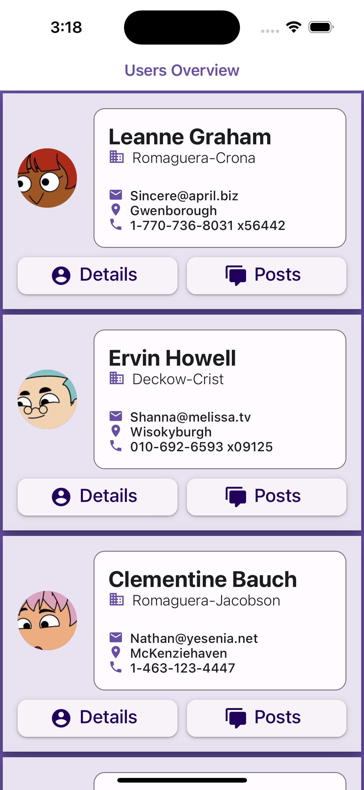

# Simple User Display app with JSONPlaceholder

An demo application for displaying user data designed with react native paper library.

## Project Screenshots

    
    
    

## Installation and Setup Instructions

Clone down this repository. You will need `node` and `npm` installed globally on your machine.

Installation:

`npm install`

To Start Server:

`npm start`

## Important 3rd Party libraries used

- JSONPlaceholder for mock data (https://jsonplaceholder.typicode.com/)
- React Native Paper for design (https://reactnativepaper.com/)
- dotenv for keeping apikey safe (https://www.npmjs.com/package/react-native-dotenv)
